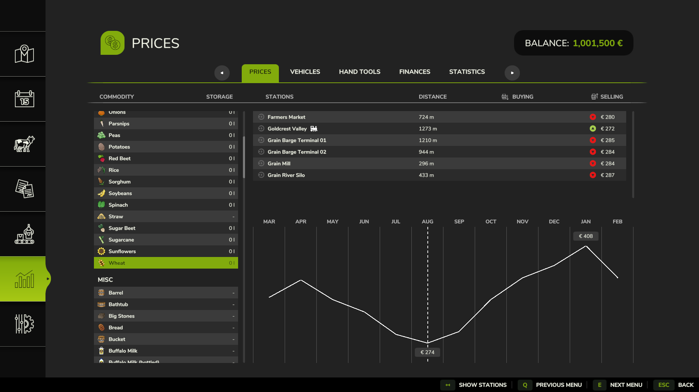
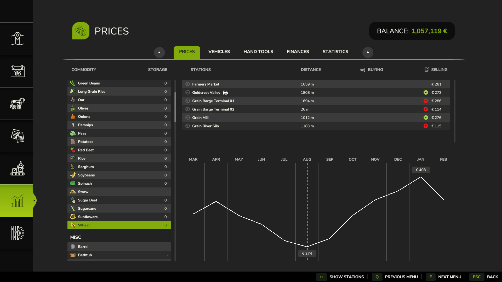

# Realistic Market Demand — Farming Simulator 25

[](CHANGELOG.md)
[](https://www.farming-simulator.com/)
[](LICENSE)

A script mod that makes selling more realistic: each buyer has a **finite monthly
appetite**. As you keep dumping the same crop at the same selling station, the
price it pays **gradually falls** — flooding a market crashes its price. Spread
sales across stations, across crops, or across months and you keep prices high.

> **Status: v0.1 — early release.** Single-player only, no custom menu yet.
> Balancing values are first-pass; feedback very welcome.

## See it in action

Same crop, same moment, across every station — before and after flooding
selling points with wheat. Grain River Silo's price collapses from **€287** to
**€115** while the untouched stations hold steady:

| Before (fresh market) | After (flooded Grain River Silo) |
|---|---|
|  |  |

## Features

- 📉 **Demand-based pricing** — price drops continuously as you sell more of a
  fill type at a station within the month. No sudden cliffs, no hard "you can't
  sell" wall — just diminishing returns.
- 🏪 **Per-station, per-crop** — each selling point tracks each fill type
  independently. The dairy flooding wheat doesn't affect the biogas plant's
  price for silage.
- 🗓️ **Monthly recovery** — demand resets each in-game month, so prices bounce
  back. Patience pays.
- 💾 **Persistent** — demand is saved with your game and restored on load.
- 🔔 **Point-of-sale feedback** — a "Saturated market" line appears in the income
  HUD right next to your harvest income, showing exactly how much you left on the
  table by dumping into a flooded market. The penalty is visible, not hidden.
- 🧾 **Transparent** — everything it does is logged (prefix
  `[RealisticMarketDemand]`), so you can see exactly what's happening.

## How it works

Within a monthly period, each `(station, fill type)` pair accumulates the liters
you've sold. The price multiplier falls linearly from `1.0` toward a floor
(default **0.55**, i.e. down to 55% of the normal price) as consumption
approaches a threshold (default **250,000 L**), then holds at the floor:

```
multiplier = 1 − (1 − floor) × min(litersSold / litersForFullDrop, 1)
```

Selling is never blocked — the price just gets progressively worse, exactly like
saturating a real local market. A new month resets the counter and the price
recovers.

This layers on top of the game's own dynamic pricing; it doesn't replace it.

## Installation

**Players**

1. Download the latest `FS25_RealisticMarketDemand.zip` from the
   [Releases](https://github.com/HLLMR/FS25_RealisticMarketDemand/releases) page.
2. Drop the `.zip` (do not unzip) into:
   `Documents/My Games/FarmingSimulator2025/mods/`
3. Enable **Realistic Market Demand** in the mod list when starting or loading a
   single-player savegame.

**From source (developers)** — see [CONTRIBUTING.md](CONTRIBUTING.md).

## Difficulty

The strength of the effect follows your savegame's **economic difficulty** — no
separate setting to manage. Harder economy, harsher saturation:

| Economic difficulty | Price floor | Liters to reach the floor |
|---------------------|-------------|---------------------------|
| Easy   | 0.60 | 300,000 L |
| Normal | 0.50 | 150,000 L |
| Hard   | 0.40 | 75,000 L |

`floor` = lowest fraction of normal price a fully-saturated market pays; the
liters column = how much of one crop at one station (within a month) drives the
price to that floor. Tweak the numbers at the top of `scripts/DemandModel.lua`
(`PRESETS`) if you want. To see per-sale math in the log, set
`RMDLogging.debugEnabled = true` in `scripts/RMDLogging.lua`.

## Compatibility

- **Farming Simulator 25.**
- **Single-player** in v0.1 (`multiplayer` is disabled in the manifest).
- Coexists with the base game's dynamic pricing and "great demand" events.
- Should be compatible with most maps and selling stations, since it hooks the
  standard `SellingStation` class rather than any specific map. Conflicts are
  most likely with other mods that overwrite `SellingStation:sellFillType` or
  `SellingStation:getEffectiveFillTypePrice`.

## Known limitations (v0.1)

This is an early scaffold; two behaviors still need in-game confirmation and are
tracked in the [CHANGELOG](CHANGELOG.md):

1. **Price linkage.** The design assumes the money paid by `sellFillType` derives
   from `getEffectiveFillTypePrice`. If a sale's payout doesn't change, the
   reduction will be moved into the sell hook directly.
2. **Save trigger.** Persistence uses the community-standard
   `FSCareerMissionInfo.saveToXMLFile` seam, which needs verification against
   this build.

No custom GUI and no in-game configuration menu yet. No custom 3D assets.

## Contributing

Bug reports, balance feedback, and pull requests are welcome — see
[CONTRIBUTING.md](CONTRIBUTING.md). Please include your FS25/mod versions and the
`[RealisticMarketDemand]` lines from `log.txt` when reporting issues.

## License

Released under [CC BY-NC-SA 4.0](LICENSE). You may share and adapt the mod with
credit, for non-commercial use, under the same license. **Please do not re-upload
to sites that paywall or monetize mod downloads.**

## Disclaimer

Farming Simulator 25 and the GIANTS Engine are property of GIANTS Software GmbH.
This is an unofficial, fan-made mod, not affiliated with or endorsed by GIANTS
Software. Use of the mod must also comply with the Farming Simulator EULA.
